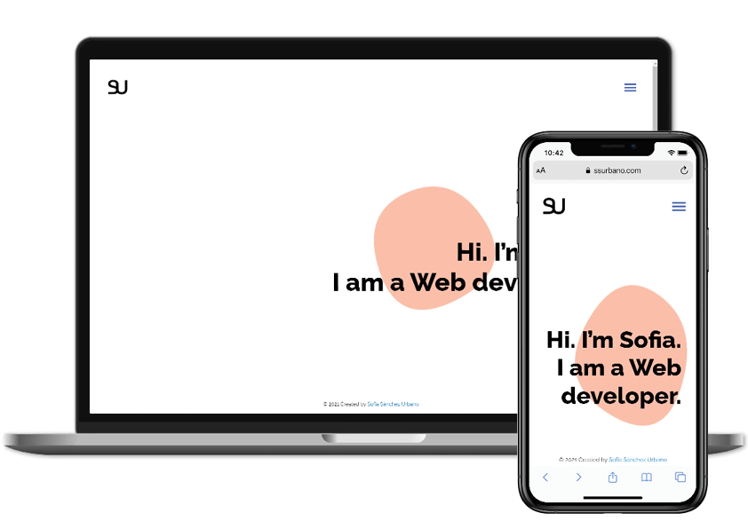

# Web Development Portfolio

Personal Website with my latest selected web development projects



## Install 🚀

* Install all dependencies described in package.json:

```
$ npm install
```

* Run the development server:

```bash
npm run dev
# or
yarn dev
```

* Open [http://localhost:3000](http://localhost:3000) with your browser to see the result.

## Links 
[Live Web www.ssurbano.com](https://ssurbano.com/)

## Built with 
* [React](https://reactjs.org/)
* [Vercel](https://vercel.com/) - For deployment.

## Created by

* [**Sofía Sánchez Urbano**](https://github.com/sofisdev)
* [LinkedIn](https://www.linkedin.com/in/sofiasanchezurb/)

## License 

Copyright (c) 2021 Sofía Sánchez Urbano
MIT License
